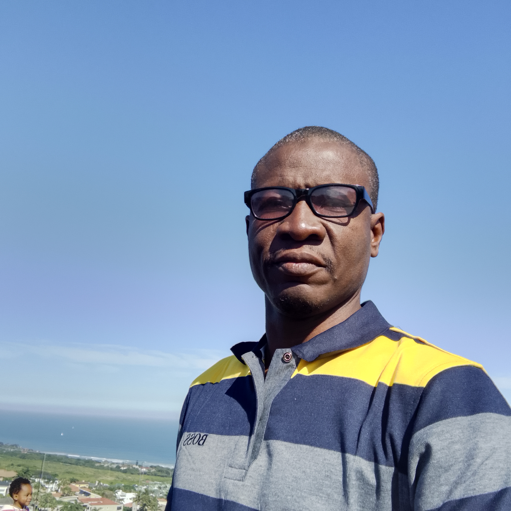

---
layout: page
title: Participants 
--- 

<h4 style="color:DodgerBlue;"> William Nelson Mwakalasya  Lecturer, Muhimbili University of Health and Allied Sciences, Tanzanian  </h4> 
Email: <a href="mailto:wnmwakalasya@gmail.com">wnmwakalasya@gmail.com</a>  

   
   I'm Environmental Health Practitioner based on environmental and occupational toxicology. My mission is to uncover the role of the ever-changing environment in the epidemiology of diseases. My current focus is on understanding how the agriculture sector affects the health of those working there.    
 <b>Research Interest:</b> Occupational toxicology; climate change; environmental toxicology 
   
  
 
<h4 style="color:DodgerBlue;"> Hawah Nabajja   Lecturer, Makerere University, Uganda </h4> 
Email: <a href="mailto:hnabajja@gmail.com">hnabajja@gmail.com</a>  

   
   Hawah is influential and adaptable to both managerial and statistical contexts, with more than three years of experience in managerial work, data collection, management, analysis, research and presentation. Hawah has proven competencies in strategic thinking and analysis, supervision management and data presentation. Having completed her master's degree in Biostatistics, she successfully started a teaching career at Makerere University Business School specializing in Quantitative methods. 
Hawah has been successful in community resilience programmes and leading research teams for both short-term and long-term research projects for different organizations e.g. Infectious Disease Institute (IDI)School of Public Health Makerere University, The Aids Support Organization (TASO) and Infectious Disease Institute (IDI).    
 <b>Research Interest:</b> Machine Learning; Non Communicable ; Climate Change 
   
  
<h4 style="color:DodgerBlue;"> Samuel Oluwafemi Oyamakin   Lecturer, University of Ibadan and University of Ibadan Research Foundation, Nigeria  </h4> 
Email: <a href="mailto:fm_oyamakin@yahoo.com">fm_oyamakin@yahoo.com</a>  

   
   My name is Samuel Oluwafemi Oyamakin, and I hold bachelor's, master's, and Ph.D. degrees in Statistics from the University of Ibadan, where I currently work as a Senior Lecturer and a Senior Research Fellow at the University of Ibadan Research Foundation. My research areas are Biostatistics, Forest biometrics, and Health Data Science.    
 <b>Research Interest:</b> Biostatistics; Climate change; Data science and Forest Biometrics. 
   
 
 
<h4 style="color:DodgerBlue;"> Damilare Babatunde   Postgraduate Student, University of South Africa, South Africa  </h4> 
Email: <a href="mailto:damilarebabatunde21@gmail.com">damilarebabatunde21@gmail.com </a>  

   
   As a dedicated PhD student, Damilare delves into the fascinating realms of molecular modelling. With a passion for scientific inquiry and a commitment to unravelling complex phenomena, Damilare aims to contribute to the advancement of knowledge in drug discovery and energy production through rigorous research and analytical thinking.     
 <b>Research Interest:</b> Computational Chemistry; Energy Production; Protein-Ligand Interactions. 
   
 
 
<h4 style="color:DodgerBlue;"> Enoch Sakyi-Yeboah   Lecturer, University of Ghana, Ghana </h4> 
Email: <a href="mailto:esyeboah@ug.edu.gh">esyeboah@ug.edu.gh </a>  

   
   I am a statistician and work as a Lecturer at the Department of Statistics and Actuarial Science,  University of Ghana.     
 <b>Research Interest:</b> Machine learning; Probability; Climate change. 
   
 
 
 
 

<h4 style="color:DodgerBlue;"> Pankras Luoga   Lecturer, Muhimbili University of Health and Allied Sciences, Tanzania </h4> 
Email: <a href="mailto:luoga.pankras1@gmail.com">luoga.pankras1@gmail.com </a>  

   
   Five years experience managing primary Health Systems in Tanzania and three years as an academician teaching management, leadership, Monitoring and evaluation in Health. My research interests include project management, primary health systems, implementation science, monitoring and evaluation, and writing articles on various general and specific health topics in local Newspapers.    
 <b>Research Interest:</b>  primary health systems management; implementation science; monitoring and evaluation. 
   
  
 
 
<h4 style="color:DodgerBlue;"> Esther Nhang'ano    Lecturer, Muhimbili University of Health and Allied Sciences - MUHAS, Tanzania </h4> 
Email: <a href="mailto:mlawaesther@gmail.com ">mlawaesther@gmail.com </a>  

   
   Esther Nhang’ano is an Academician at MUHAS, Tanzania teaching various topics including water and sanitation, food safety and hygiene, and climate change. Before joining MUHAS she worked with Dar es Salaam City Council for 15 years around IPC/WASH. Her research interests address the area of WASH, IPC, climate change, food safety & hygiene.    
 <b>Research Interest:</b> Water, sanitation and hygiene; climate change; Infection prevention and control. 
   
  
 
 

<h4 style="color:DodgerBlue;"> Sylvestre Mbanza    Lecturer, University of Tourism, Technology and Business Studies (UTB-Rwanda), Rwanda </h4> 
Email: <a href="mailto:smbanza@gmail.com"> smbanza@gmail.com </a>  

     Rwandan and currently working as a lecturer at the University of Tourism, Technology and Business Studies in Rwanda since 2016. Completed a master's degree in Food Security at the University of KwaZulu-Natal, and PhD degree in Health Science at AZTECA University.    
 <b>Research Interest:</b> Food security and nutrition. 
   
 
 

<h4 style="color:DodgerBlue;"> Insaaf Rashid   Undergraduate Student, University of KwaZulu Natal, South Africa </h4> 
Email: <a href="mailto:insaafrashid78660@gmail.com"> insaafrashid78660@gmail.com </a>  

     My name is Insaaf Rashid and I am a final year Bachelor of Commerce student at the University of KwaZulu Natal, majoring in Information Systems and Technology and Supply Chain Management. While I am passionate about leveraging technology and optimizing logistics, I aspire to make a positive impact in the business world through innovative solutions. I have a keen interest in data science and its application in environmental issues, particularly in the field of Supply Chain management.    
 <b>Research Interest:</b> Sustainability; Data Science; Machine Learning. 
   
 
 

<h4 style="color:DodgerBlue;"> Mary Amenudzi   Research Fellow, Kwame Nkrumah University of Science and Technology, Ghana </h4> 
Email: <a href="mailto:ewhuraharmah@gmail.com"> ewhuraharmah@gmail.com </a>  

     I recently graduated with a Bachelor's Degree in Biological Sciences. I have a strong interest in Microbiology and I'm interested in continuing my education with a Masters Degree in Biological Sciences. I have always had a passion to solve problems specifically health issues, which has brought me this far further into Biostatistics.    
 <b>Research Interest:</b> Microbiology; infectious disease; biostatistics. 
   
 
 

<h4 style="color:DodgerBlue;"> Yao Etienne KOUAKOU   Lecturer, NANGUI ABROGOUA UNIVERSITY, Abidjan, Côte d'Ivoire </h4> 
Email: <a href="mailto:etienne.kouakou@csrs.ci"> etienne.kouakou@csrs.ci </a>  

     I am a Researcher in the Geosciences and Environment Laboratory at NANGUI ABROGOUA University, Abidjan, Ivory Coast. I have a PhD in Hydrology, Hydrogeology and Environment and a Master's degree in Geomatics. Postdoctoral researcher in the HE2AT Center project, my research focuses on the application of GIS and remote sensing to climate change, water resources and health.    
 <b>Research Interest:</b> Water and sanitation; Climate change; Health. 
   
 
 
<h4 style="color:DodgerBlue;"> Napoleon Bellua Sam   Lecturer, University for Development Studies, Ghana </h4> 
Email: <a href="mailto:belluadsm@yahoo.com"> belluadsm@yahoo.com </a>  

     I am a senior lecturer, a PhD holder in Epidemiology and Biostatistics and also a scholar at Leaders of Africa Institute. I am also the manager of the Data Centre established through the collaboration of the NIHR Global Surgery Unit at my University. I am a  multidisciplinary researcher with a special emphasis on Evidence-Based Medicine, Health Care Efficiency Measurement and Statistical modelling. I am also a certified Marriage and Family Counselor.      
 <b>Research Interest:</b> Data Science; Climate Change; Health Issues. 
   
 
 
<h4 style="color:DodgerBlue;">Cherlynn Dumbura   Research Fellow, CeSHHAR Zimbabwe, DSI HE2AT Center Research Hub, Zimbabwe </h4> 
Email: <a href="mailto:dumburac@gmail.com"> dumburac@gmail.com </a>  

     Cherlynn Dumbura is an Associate Research scientist at the Centre for Sexual Health and HIV AIDS Research Zimbabwe (CeSHHAR). She has a Master's degree in Big Data Analytics and a Master's degree in Biostatistics. She has worked in the area of maternal and child health with a focus on malnutrition (Zimbabwe), she was an analyst on the HOPESAM study and is currently working in the area of maternal and child health with a focus on the effects of climate change in sub-Saharan Africa. Cherlynn is a  Research Fellow on the PRECISE study and a Data Scientist on the HE2AT Center Research Project.      
 <b>Research Interest:</b> Climate change, machine learning, maternal and child health. 
   
 
 

<h4 style="color:DodgerBlue;">Prosper  Adiku   Postgraduate Student, University of Ghana, Ghana </h4> 
Email: <a href="mailto:prosyaw@gmail.com"> prosyaw@gmail.com </a>  

     Prosper Adiku is a Ph.D. Candidate at the Institute for Environment and Sanitation Studies (IESS) of the University of Ghana. With his undergraduate and graduate degrees in Oceanography, Fisheries, and Physical Oceanography, respectively. He has a strong background in climate change issues, particularly coastal risks, vulnerabilities, and impacts. He has been part of a number of environmental and climate change-related research and related stakeholder engagement activities involving international, national, and local organisations over the years. He has a keen interest in science communication, and the application of Geographic Information Systems (GIS) in understanding and providing solutions to climate and environmental impacts in hotspots, including coastal areas.      
 <b>Research Interest:</b> Climate Change; climate vulnerability; science communication. 
   
 
 

<h4 style="color:DodgerBlue;"> Ntokozo Thobekile  Dladla   Non-Academia, University of KwaZulu-Natal, South Africa </h4> 
Email: <a href="mailto:dladlalnt@gmail.com"> dladlalnt@gmail.com </a>  

     With a master’s degree in agricultural science, Ntokozo Dladla offers seven years of experience in coordinating research and events. She works at the University of KwaZulu-Natal as a Public Relations Assistant for the College of Agriculture, Engineering & Science.      
 <b>Research Interest:</b> Nutrition; Food Security; Food Production. 
   
 
 
 
 

<h4 style="color:DodgerBlue;"> Medina Wandella   Postgraduate Student, Muhimbili University of Health and Allied Sciences (MUHAS), Tanzania </h4> 
Email: <a href="mailto:mwandella@gmail.com"> mwandella@gmail.com </a>  

     Medina Wandella is a Ph.D. Candidate - Nutritional Epidemiology at Muhimbili University of Health and Allied Sciences (MUHAS) in Tanzania. My study focuses on the Food environment and sustainable healthy diet aiming to enhance maternal nutrition among pregnant women in Tanzania. My research passion is on Maternal, Infant, Young Child, and Adolescent Nutrition (MIYCAN).     
 <b>Research Interest:</b> Food environment; Sustainable healthy diet; Maternal and child nutrition. 
   
 
 

<h4 style="color:DodgerBlue;"> Mandu Grace Umanah   Research Fellow, University of Ibadan Research Foundation, Nigeria </h4> 
Email: <a href="mailto:mandiemichael15@gmail.com"> mandiemichael15@gmail.com </a>  

     Mandu is a veterinarian with a Master’s degree in Veterinary Microbiology. I am a research graduate at the University of Ibadan Research Foundation (UI-RF). Also, I am a PhD student at the University of Ibadan. My research interest focuses on Infectious disease, ONE health, zoonosis, maternal, child and adolescent health.     
 <b>Research Interest:</b> Infectious disease; ONE Health; Maternal, Child and Adolescent health. 
   
 
 

<h4 style="color:DodgerBlue;"> Peter Koleoso    Lecturer, Nile University of Nigeria, Nigeria </h4> 
Email: <a href="mailto:petalfred@yahoo.com"> petalfred@yahoo.com </a>  

     Peter Koleoso is a reputable statistician with a strong academic background. With a BSc in Mathematical Sciences (Statistics option), an MSc in Medical Statistics, and a PhD in Statistics, Peter possesses extensive expertise in quantitative analysis, research methodologies, data interpretation and communication.     
 <b>Research Interest:</b> Biostatistics; Data Science; Climate change. 
   
 
 
<h4 style="color:DodgerBlue;">  Ayogeboh Epizitone   Postgraduate Student, Durban University of Technology, SA, Cameroonian </h4> 
Email: <a href="mailto:ayo2811@gmail.com"> ayo2811@gmail.com </a>  

     A. Epizitone is a researcher and a PhD candidate whose research goals and achievements have been centered on Information Technology in the 21st century. She has multiple certificates, diplomas and a master's degree. Her experience and background cover IT, Accounting, Finance, Business, and Management sciences. She is also a Durban University of Technology’s ICT and Society Research group member. She holds a special inclination towards scientific computational methods in the specialized areas of machine intelligence, computer systems, software implementations and data sciences. And she is dedicated to incorporating scientific cutting-edge data-intensive techniques to generate pertinent, astute and valuable solutions to society’s acute problems. Hence her current and future work and interests from this angle delve into the use of data science, Machine learning, and artificial intelligence with an emphasis on building long-term intelligent, resilient, and sustainable systems for efficient and effective applications.     
 <b>Research Interest:</b> Data sciences; information management; Machine Learning & Deep Learning. 
   

<h4 style="color:DodgerBlue;"> Abiodun Ikotun   Postgraduate Student, University of Kwazulu-Natal, SA, Nigeria </h4> 
Email: <a href="mailto:biodunikotun@yahoo.com"> biodunikotun@yahoo.com </a>  

     I recently completed my PhD in Computer Science from University of Kwazulu-Natal, Pietermaritzburg campus with a research focus on Unsupervised Machine Learning. My research interest is in the application of metaheuristic-based clustering algorithms for data analysis.     
 <b>Research Interest:</b> Unsupervised learning; Clustering; Image classification. 
   
 
 
 
<h4 style="color:DodgerBlue;"> Rogers Nsubuga   Postgraduate Student, Makerere University, Uganda </h4> 
Email: <a href="mailto:rnsubuga.k@gmail.com"> rnsubuga.k@gmail.com </a>  

     I am a scholar of Biostatistics with experience of over 5 years in HIV research entailing clinical trials, cohort studies and vaccine trials. I am passionate about data science and applications to provide solutions to the world.     
 <b>Research Interest:</b> Machine Learning;Climatic change; Social Network ananlysis. 
   
 
 
 
<h4 style="color:DodgerBlue;"> Olufemi Adedokun   Research Fellow, University of Ibadan Research Foundation Ajibode, Ibadan, Nigeria </h4> 
Email: <a href="mailto:adedokunolufemi@gmail.com"> adedokunolufemi@gmail.com </a>  

     Adedokun Olufemi is Food Scientist/Nutritionist with a PhD degree in Food Science and Technology. He is also a  registered Public Analyst with expertise in Food analysis. Olufemi is a Research Fellow at the University of Ibadan Research Foundation Ajibode, Ibadan. My research interests are New product development, Adolescent health and nutrition, Neglected Tropical Diseases, Climate change, and Data Science.    
 <b>Research Interest:</b> Food system; Adolescent health and nutrition; Climate change. 
   
 
 
